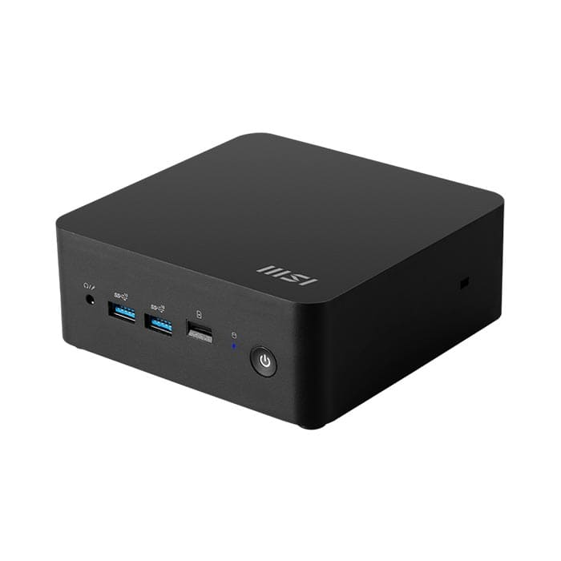
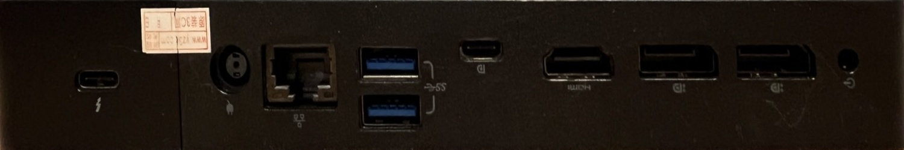
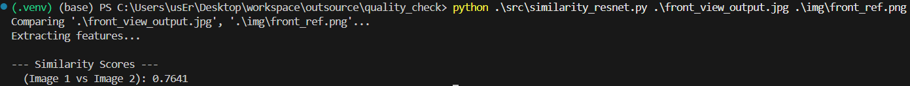

# Holes Inspector

This repository was made in order to compare the each components in object in an image to the reference one. To archieve this goal, the process is divide to 2 main parts which are reprojection and similarity comparision using cosine similary.


## Installation

Create environment for containing necessary dependencies

```bash
  python -m venv .venv
  source .venv/bin/activate
```
### Install dependencies

```bash
  pip install torch torchvision opencv-python Pillow
```
## Usage

### Reprojection

```bash
python src/reprojection.py --img <your-image-name>
```
After execute the code, the input image will be shown. Corners of the side that will be inspected are needed to be identified by left-clicking on each corner of an object in image. The order of clicking need to be the same as sequence below

```bash
top-left > top-right > bottom-right > bottom-left
```
Then the output of reprojected image will be saved as front_view_ourput.jpg. The side in file name can be specifed by add an option to the executing command line.

```bash
python src/reprojection.py --img <your-image-name> --side <your-reprojected-side>
```

### Similarity Comparision
After the object face in image was reprojected, the image will be compared to the reference object to determine completeness of object in an image.



```bash
python src/similarity_vit.py <path-to-image> <path-to-reference-image>
```
